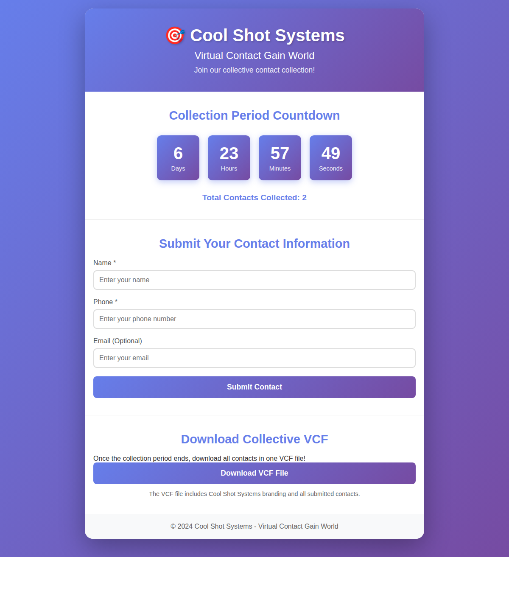

# Cool Shot Systems - Virtual Contact Gain World 🎯

A web application for collecting contact information from multiple visitors into a single, collective VCF (vCard) file. Perfect for events, meetups, or networking sessions where participants want to share their contact information with the entire group.

## Features

- 🔗 **Multi-Session Support**: Create unlimited collection sessions with unique shareable links
- ⏱️ **Customizable Duration**: Set collection period from 1 to 30 days (default: 5 days)
- 📝 **Simple Contact Form**: Visitors submit their Name, Phone, and optionally Email
- ⏱️ **Countdown Timer**: Live countdown showing the collection period
- 📊 **Real-time Stats**: Display of total contacts collected per session
- 📥 **VCF Download**: Generate and download a single VCF file containing all contacts
- 🏢 **Company Branding**: VCF file includes Cool Shot Systems branding
- 💅 **Modern UI**: Beautiful gradient design with responsive layout
- ☁️ **Vercel Ready**: Configured for easy deployment on Vercel

## Installation

1. Clone the repository:
```bash
git clone https://github.com/RayBen445/Cool-Shot-Systems-Virtual-Contact-Gain-.git
cd Cool-Shot-Systems-Virtual-Contact-Gain-
```

2. Install dependencies:
```bash
npm install
```

3. Start the server:
```bash
npm start
```

4. Open your browser and navigate to:
```
http://localhost:3000
```

## Usage

### Creating a New Session

1. **Visit Homepage**: Go to the main page
2. **Set Duration**: Choose collection period (1-30 days, default: 5)
3. **Create Session**: Click "Create Session & Get Link"
4. **Share Link**: Copy and share the unique session URL with participants

### For Visitors

1. **Access Session**: Open the shared session link
2. **View Countdown**: See time remaining in collection period
3. **Submit Contact**: Fill out the form with Name and Phone (Email is optional)
4. **Download VCF**: Click "Download VCF File" to get all contacts from this session

### Session Management

Each session is completely independent with its own:
- Unique URL for sharing
- Separate contact collection
- Individual countdown timer
- Dedicated VCF download

### For Administrators

The application automatically:
- Creates session data files in the `data/` directory
- Sets collection end date based on specified days
- Generates VCF files on-demand with Cool Shot Systems branding

## Configuration

The default collection period is **5 days**. You can customize this when creating a session through the web interface.

You can change the server port:

```bash
PORT=8080 npm start
```

## Deployment on Vercel

This application is configured for deployment on Vercel:

1. **Push to GitHub**: Ensure your code is in a GitHub repository
2. **Import to Vercel**: 
   - Go to [vercel.com](https://vercel.com)
   - Click "Import Project"
   - Select your GitHub repository
3. **Deploy**: Vercel will automatically detect the configuration and deploy

The `vercel.json` file is already configured for serverless deployment.

### ⚠️ Important: Data Persistence on Vercel

**Current Setup**: Sessions use **in-memory storage** on Vercel, which means:
- ❌ Data is **NOT persistent** across deployments
- ❌ Sessions will be **lost** when serverless functions restart
- ✅ Works perfectly for **demos and testing**

**For Production**: See [VERCEL_DEPLOYMENT.md](VERCEL_DEPLOYMENT.md) for details on:
- Adding a database (Vercel Postgres, MongoDB, etc.)
- Alternative deployment platforms with persistent storage
- Migration guide for production use

**Local Development**: Uses file-based storage in `data/` directory (persistent).

## API Endpoints

- `POST /api/session/create` - Create a new collection session
  - Body: `{ "days": 5 }` (optional, defaults to 5)
  - Returns: `{ "sessionId", "endDate", "shareUrl" }`
- `GET /api/session/:sessionId` - Get session information
  - Returns: `{ "endDate", "contactCount", "createdAt" }`
- `GET /api/countdown?sessionId=xxx` - Get countdown info (legacy, auto-creates default session)
- `POST /api/submit` - Submit a new contact
  - Body: `{ "name", "phone", "email"?, "sessionId"? }`
- `GET /api/download?sessionId=xxx` - Download the VCF file for a session

## VCF File Format

The generated VCF file includes:
1. **Cool Shot Systems Company Card** (at the top)
2. **All Submitted Contacts** with their:
   - Full Name
   - Phone Number
   - Email Address (if provided)

Example VCF output:
```
BEGIN:VCARD
VERSION:3.0
FN:Cool Shot Systems
ORG:Cool Shot Systems
NOTE:Virtual Contact Gain World - Collective Contact Collection
END:VCARD
BEGIN:VCARD
VERSION:3.0
FN:John Doe
TEL:555-1234
EMAIL:john@example.com
END:VCARD
```

## Technologies Used

- **Backend**: Node.js with Express
- **Frontend**: Vanilla JavaScript, HTML5, CSS3
- **Data Storage**: JSON file-based storage
- **VCF Generation**: Custom vCard 3.0 format

## File Structure

```
Cool-Shot-Systems-Virtual-Contact-Gain-/
├── server.js           # Express server and API endpoints
├── package.json        # Node.js dependencies
├── vercel.json         # Vercel deployment configuration
├── data/               # Session data storage (auto-generated)
│   └── *.json         # Individual session files
├── public/
│   ├── index.html     # Homepage - create sessions
│   ├── session.html   # Session page - submit contacts
│   ├── styles.css     # CSS styling
│   ├── home.js        # Homepage JavaScript
│   └── session.js     # Session page JavaScript
└── README.md          # This file
```

## Screenshot



## License

MIT

## Author

Cool Shot Systems - Virtual Contact Gain World

---

Made with ❤️ by Cool Shot Systems